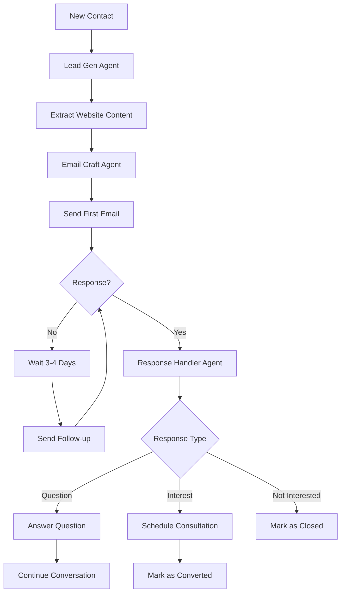

# Cold Outreach Agent - System Planning

## 🎯 System Overview

### Core Flow
```
Product Info → AI Query Generation → Google Maps Scraping → Website Scraping → 
Email Extraction → AI Email Personalization → Mailgun Sending → Response Monitoring → 
AI Response Handling → Campaign Management → Analytics
```

### LangGraph Agent Architecture
```
┌─────────────────────────────────────────────────────────────────┐
│                    LANGGRAPH ORCHESTRATOR                       │
├─────────────────────────────────────────────────────────────────┤
│  ┌─────────────┐  ┌─────────────┐  ┌─────────────┐  ┌──────────┐│
│  │Lead Gen     │  │Email Craft  │  │Campaign Mgr │  │Response  ││
│  │Agent        │  │Agent        │  │Agent        │  │Handler   ││
│  │             │  │             │  │             │  │Agent     ││
│  └─────────────┘  └─────────────┘  └─────────────┘  └──────────┘│
└─────────────────────────────────────────────────────────────────┘
                              │
┌─────────────────────────────────────────────────────────────────┐
│                    LANGCHAIN TOOLS LAYER                       │
├─────────────────────────────────────────────────────────────────┤
│  • Google Maps Scraper    • Website Content Extractor          │
│  • Email Finder          • Mailgun Sender                      │
│  • Supabase DB           • Content Personalizer                │
│  • Response Classifier   • Calendar Scheduler                  │
└─────────────────────────────────────────────────────────────────┘
```

## 🏗️ System Architecture

### Database Schema (Supabase)

#### Companies Table
```sql
CREATE TABLE companies (
  id UUID PRIMARY KEY DEFAULT gen_random_uuid(),
  name VARCHAR NOT NULL,
  domain VARCHAR,
  industry VARCHAR,
  created_at TIMESTAMP DEFAULT NOW(),
  updated_at TIMESTAMP DEFAULT NOW()
);
```

#### Campaigns Table  
```sql
CREATE TABLE campaigns (
  id UUID PRIMARY KEY DEFAULT gen_random_uuid(),
  company_id UUID REFERENCES companies(id),
  name VARCHAR NOT NULL,
  product_name VARCHAR NOT NULL,
  product_description TEXT NOT NULL,
  product_link VARCHAR NOT NULL,
  status VARCHAR DEFAULT 'active', -- active, paused, completed
  emails_per_week INTEGER DEFAULT 2,
  campaign_duration_weeks INTEGER DEFAULT 6,
  created_at TIMESTAMP DEFAULT NOW(),
  updated_at TIMESTAMP DEFAULT NOW()
);
```

#### Contacts Table
```sql
CREATE TABLE contacts (
  id UUID PRIMARY KEY DEFAULT gen_random_uuid(),
  campaign_id UUID REFERENCES campaigns(id),
  email VARCHAR NOT NULL, -- Primary email
  additional_emails JSONB, -- Store other found emails here
  company_name VARCHAR,
  domain VARCHAR,
  industry VARCHAR,
  website_content TEXT,
  enriched_data JSONB, -- Added for storing enriched lead data
  contact_attempts INTEGER DEFAULT 0,
  response_status VARCHAR DEFAULT 'no_response', -- no_response, responded, converted, unsubscribed
  last_contacted_at TIMESTAMP,
  responded_at TIMESTAMP,
  conversation_stage VARCHAR DEFAULT 'cold', -- cold, engaged, negotiating, converted
  created_at TIMESTAMP DEFAULT NOW(),
  updated_at TIMESTAMP DEFAULT NOW(),
  UNIQUE(campaign_id, email)
);
```

#### Email_History Table
```sql
CREATE TABLE email_history (
  id UUID PRIMARY KEY DEFAULT gen_random_uuid(),
  contact_id UUID REFERENCES contacts(id),
  campaign_id UUID REFERENCES campaigns(id),
  email_type VARCHAR, -- outbound_cold, outbound_followup, inbound_response, outbound_response
  subject VARCHAR,
  content TEXT,
  sent_at TIMESTAMP,
  opened_at TIMESTAMP,
  replied_at TIMESTAMP,
  mailgun_message_id VARCHAR,
  email_sequence_number INTEGER,
  created_at TIMESTAMP DEFAULT NOW()
);
```

#### Conversations Table
```sql
CREATE TABLE conversations (
  id UUID PRIMARY KEY DEFAULT gen_random_uuid(),
  contact_id UUID REFERENCES contacts(id),
  campaign_id UUID REFERENCES campaigns(id),
  message_type VARCHAR, -- inbound, outbound
  content TEXT,
  ai_generated BOOLEAN DEFAULT FALSE,
  sent_at TIMESTAMP,
  created_at TIMESTAMP DEFAULT NOW()
);
```

## 🛠️ Technology Stack

### Backend Core
- **Runtime**: Node.js + TypeScript
- **Framework**: Express.js
- **Database**: Supabase (PostgreSQL)
- **Queue**: Bull + Redis
- **Email**: Mailgun API

### AI & Automation
- **Agent Framework**: LangGraph + LangChain
- **LLM**: OpenAI GPT-4
- **Web Scraping**: Puppeteer/Playwright
- **Content Processing**: Cheerio + Custom parsers

### Frontend
- **Framework**: Next.js 14 + TypeScript
- **Styling**: Tailwind CSS
- **Components**: Headless UI + Custom components
- **State Management**: Zustand or Redux Toolkit

### DevOps & Deployment
- **Containerization**: Docker + Docker Compose
- **Process Management**: PM2
- **Monitoring**: Winston + Custom metrics
- **Security**: Helmet + Rate limiting

## 🔑 Key Design Decisions

### Why LangGraph + LangChain?

**LangGraph Benefits:**
- **State Management**: Perfect for managing complex campaign workflows with multiple decision points
- **Conditional Routing**: Can route contacts through different paths based on their responses/behavior
- **Error Recovery**: Built-in checkpointing and retry mechanisms for robust automation
- **Visual Workflows**: Easy to understand and modify campaign logic flows

**LangChain Benefits:**
- **Tool Integration**: Pre-built tools for web scraping, APIs, databases
- **Memory Management**: Maintains conversation context across multiple interactions
- **Prompt Templates**: Standardized, reusable templates for different email types
- **Model Flexibility**: Easy to switch between different AI models as needed

### Campaign Logic Flow



### Multi-Tenant Architecture

Each client gets:
- Isolated Docker container
- Separate database schema/tenant
- Individual API keys and configurations
- Custom branding and templates

## 📊 Success Metrics

### Technical KPIs
- **Email Deliverability**: >95% inbox placement
- **Response Rate**: >5% average across campaigns
- **System Uptime**: >99.5% availability
- **Processing Speed**: <30 seconds per contact processed

### Business KPIs
- **Lead Quality**: >80% valid email addresses
- **Conversion Rate**: Measurable leads to consultations/sales
- **Campaign Efficiency**: Cost per qualified lead
- **User Satisfaction**: Dashboard usability and feature adoption

## 🚀 Deployment Strategy

### Development Environment
1. Local Docker Compose setup with all services
2. Hot reloading for both frontend and backend
3. Shared development database for testing

### Production Environment
1. Separate Docker containers per client/tenant
2. Load balancer for multiple instances
3. Automated backup and disaster recovery
4. Monitoring and alerting systems

### Scaling Considerations
- Horizontal scaling of worker processes
- Database read replicas for analytics
- CDN for static assets
- Queue partitioning for high-volume campaigns

## 🔐 Security & Compliance

### Data Protection
- Encrypt sensitive contact data
- GDPR-compliant unsubscribe handling
- Secure API key management per tenant

### Email Compliance
- CAN-SPAM compliance
- Unsubscribe link in every email
- Bounce/complaint handling
- Domain reputation management

### Rate Limiting & Deliverability
- Configurable sending limits per domain
- Smart scheduling to avoid spam filters
- IP warming strategies
- Content analysis for spam prevention

## 📈 Future Enhancements

### Planned Features
- AI Receptionist integration for phone calls
- Advanced lead scoring algorithms
- Social media integration (LinkedIn, etc.)
- Video personalization capabilities
- Advanced analytics and reporting
- White-label solution for agencies